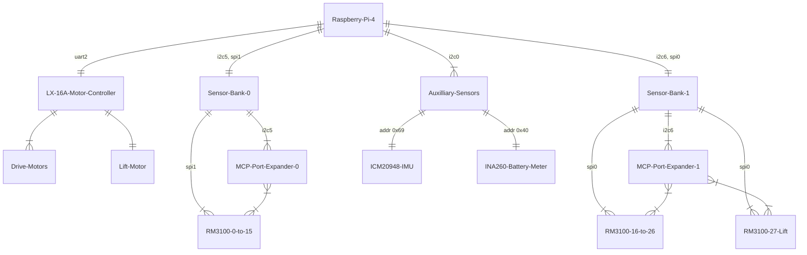

```mermaid
erDiagram
	Raspberry-Pi-4 ||--|| LX-16A-Motor-Controller : uart2
	LX-16A-Motor-Controller ||--|{ Drive-Motors : ""
	LX-16A-Motor-Controller ||--|| Lift-Motor : ""
	
	Raspberry-Pi-4 ||--|| Sensor-Bank-0 : "i2c5, spi1"
	Raspberry-Pi-4 ||--|| Sensor-Bank-1 : "i2c6, spi0"
	
	Sensor-Bank-0 ||--|{ RM3100-0-to-15 : "spi1"
	Sensor-Bank-1 ||--|{ RM3100-16-to-26 : "spi0"
	Sensor-Bank-1 ||--|{ RM3100-27-Lift : "spi0"
	Sensor-Bank-0 ||--|{ MCP-Port-Expander-0 : "i2c5"
	Sensor-Bank-1 ||--|{ MCP-Port-Expander-1 : "i2c6"
	
	MCP-Port-Expander-0 }|--|{ RM3100-0-to-15 : ""
	MCP-Port-Expander-1 }|--|{ RM3100-16-to-26 : ""
	MCP-Port-Expander-1 }|--|{ RM3100-27-Lift : ""
	
	Raspberry-Pi-4 ||--|{ Auxilliary-Sensors : "i2c0"
	Auxilliary-Sensors ||--|| ICM20948-IMU : "addr 0x69"
	Auxilliary-Sensors ||--|| INA260-Battery-Meter : "addr 0x40"
```
