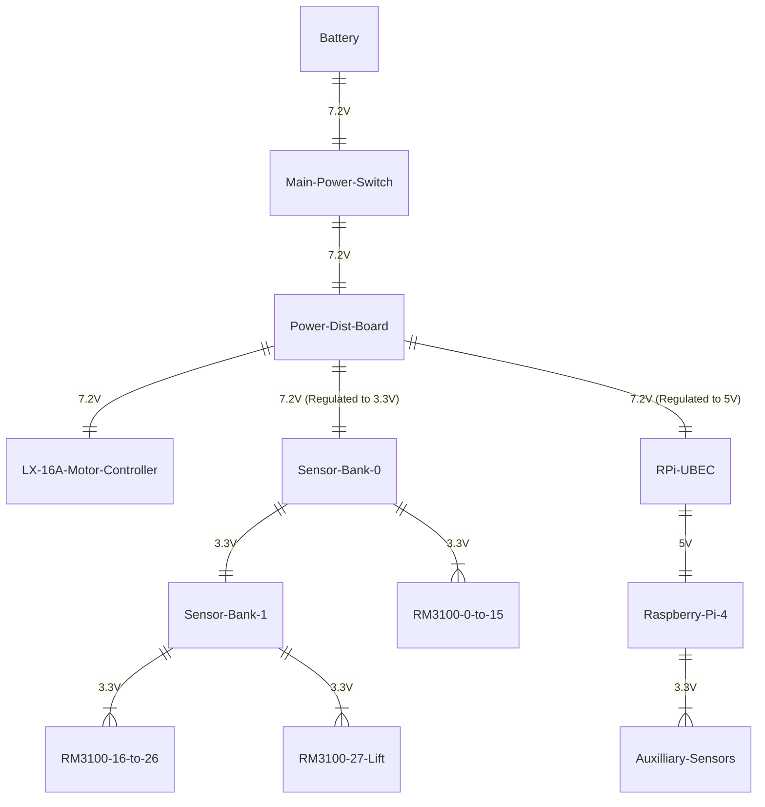

```mermaid
erDiagram
	Battery ||--|| Main-Power-Switch : "7.2V"
	Main-Power-Switch ||--|| Power-Dist-Board : "7.2V"
	
	Power-Dist-Board ||--|| LX-16A-Motor-Controller : "7.2V"
	
	Power-Dist-Board ||--|| Sensor-Bank-0 : "7.2V (Regulated to 3.3V)"
	Sensor-Bank-0 ||--|| Sensor-Bank-1 : "3.3V"

	Power-Dist-Board ||--|| RPi-UBEC : "7.2V (Regulated to 5V)"
	RPi-UBEC ||--|| Raspberry-Pi-4 : "5V"
	
	Sensor-Bank-0 ||--|{ RM3100-0-to-15 : "3.3V"
	Sensor-Bank-1 ||--|{ RM3100-16-to-26 : "3.3V"
	Sensor-Bank-1 ||--|{ RM3100-27-Lift : "3.3V"
	
	Raspberry-Pi-4 ||--|{ Auxilliary-Sensors : "3.3V"
	
	
	
	
	
	
	
```
