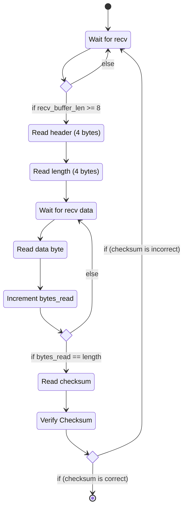

# Data Format

> Note: `Length` and `Checksum` are in big endian format.

| `Header`              | `Length`                    | `Data`                           | `Checksum`           |
| --------------------- | --------------------------- | -------------------------------- | -------------------- |
| `0x69 0x69 0x20 0x20` | `u32` Length of `Data` body | Data with length `Length`  bytes | `u16` Checksum (see below) |

# Calculating Checksum

Checksum is calculated by adding all the bytes in the data packet into a `u16`, and negating the result

```
checksum = ~(header + length + data) & 0xFFFF
```

# Parsing Flowchart


